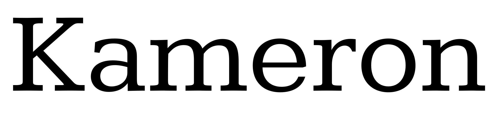

# Kameron Font Project
by Vernon Adams

## Kameron

Kameron is a reworking and fusing of several classic Slab Serif and Egyptian type forms from the early to mid Twentieth Century.

## Designer

* Vernon Adams

## License

Licensed under the [SIL Open Font License, 1.1](http://scripts.sil.org/OFL); you may only use these files in compliance with the License.

To contribute to the project, file an issue at https://github.com/googlefonts/Michroma-font